## Una guia pensada per a tu, perquè puguis utilizar el mòbil amb calma, seguretat i sense vergonya.
✧ ✧ ✧ ✧ ✧ ✧ ✧ ✧ ✧ ✧ ✧ ✧

Benvingut/da a la Guia Digital Amiga

Hola! Aquesta guia està creada per a tu, si alguna vegada t’has sentit perdut/da amb el mòbil, si et fa vergonya demanar ajuda o si tens por de tocar algun botó i equivocar-te. 

Sóc Natalia Roman Rivera, estudiant de Batxillerat, i he fet aquesta guia perquè sé que moltes persones adultes i grans tenen dificultats amb el mòbil. No és perquè no en siguin capaces, sinó perquè ningú els ha explicat les coses a poc a poc, amb calma i amb lletra gran. 

Aquí trobaràs:

- Explicacions molt senzilles 
- Passos clars i curts 
- Lletra gran i fàcil de llegir 
- Solucions a les coses que més acostumen a costar 
- I sobretot: tranquil·litat perquè aquí pots aprendre sense pressa i sense vergonya

✧ ✧ ✧ ✧ ✧ ✧ ✧ ✧ ✧ ✧ ✧ ✧

## Ajustos bàsics per fer el mòbil més còmode
### Lletra gran i clara

Si et costa llegir la pantalla, no és culpa teva. La lletra sovint és massa petita. Com fer la lletra més gran:

1. Obre Configuració.
2. Entra a Pantalla.
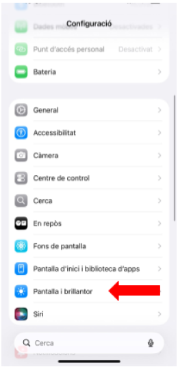
3. Toca Mida del text.
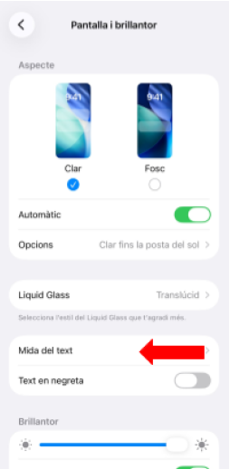
4. Mou la barra fins que la lletra es vegi gran.
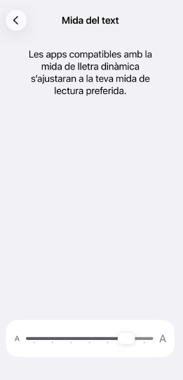

**Text en negreta:** Configuració → Accessibilitat → Text en negreta. 
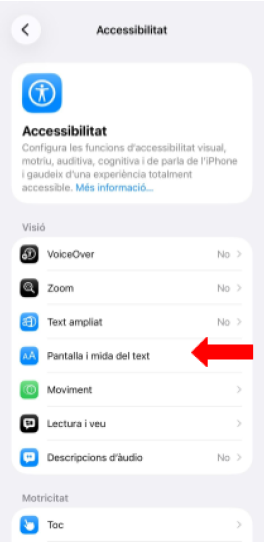
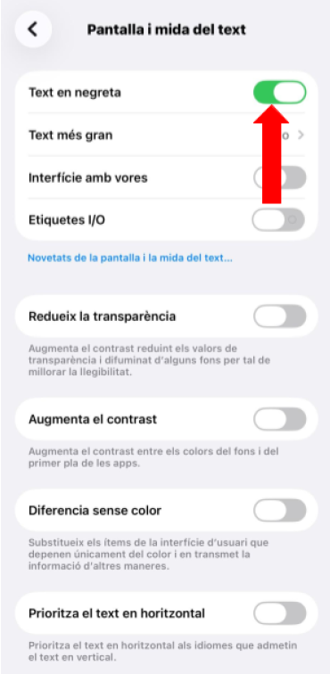

**Zoom:** Configuració → Accessibilitat → Zoom.
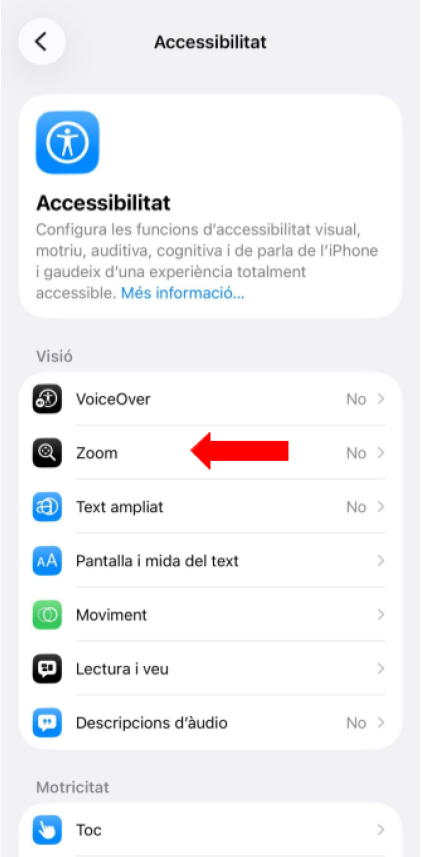
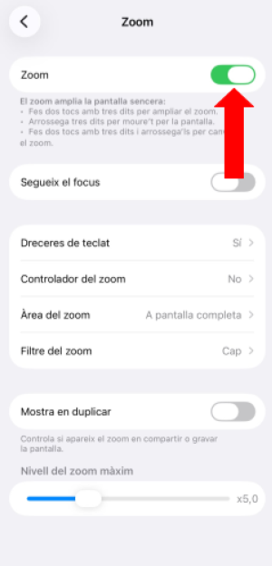

### Volum i so
- Botons laterals per pujar o baixar el volum. 
- Configuració → So → Vibració. 
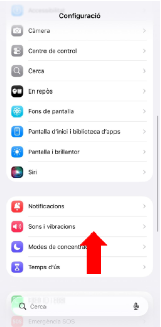
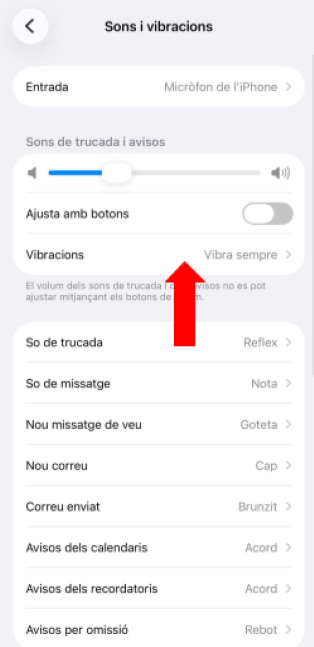
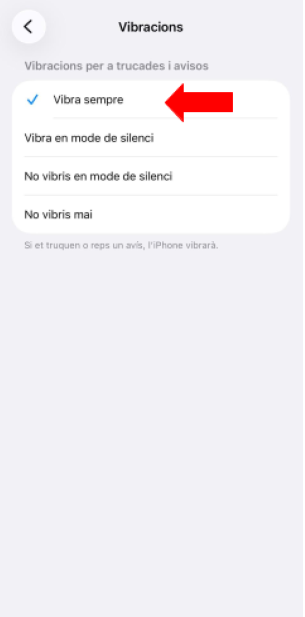

- Configuració → Accessibilitat → Subtítols.
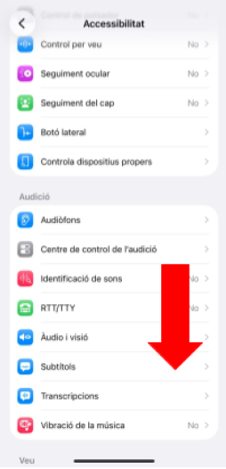
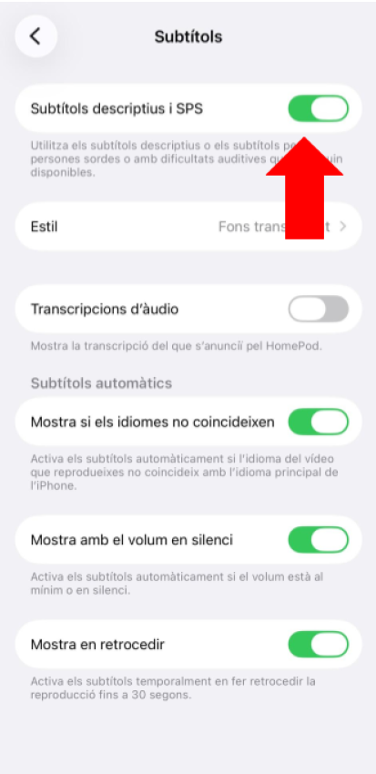

### Mode fàcil

- TalkBack: el mòbil llegeix en veu alta el que hi ha a la pantalla. 
- Mode senzill: icones grans i menys opcions.

## Aplicacions bàsiques del mòbil

**La linterna:** Serveix per il·luminar en foscor. Normalment es troba a la barra superior del mòbil. 
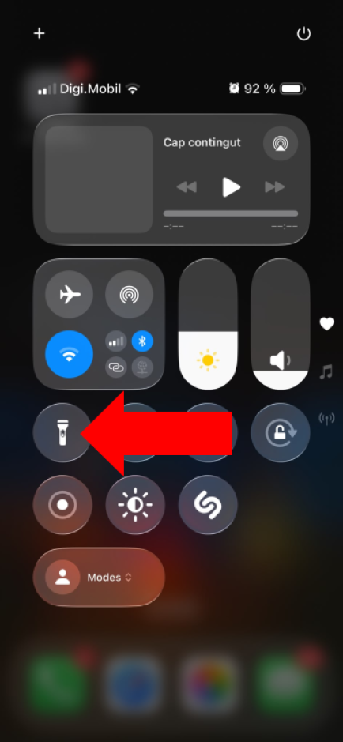

**El calendari:** Serveix per recordar cites, aniversaris i medicació. Prem “+” per afegir un recordatori. 

**Notes:** Serveix per apuntar coses importants com la compra, medicació o telèfons. 

**La calculadora:** Ideal per fer comptes ràpids sense obrir el banc.

✧ ✧ ✧ ✧ ✧ ✧ ✧ ✧ ✧ ✧ ✧ ✧ 
## WhatsApp: missatges, fotos, notes de veu i videotrucades

### Enviar un missatge
1. Obre WhatsApp.
2. Toca el nom de la persona.
3. Escriu el missatge.
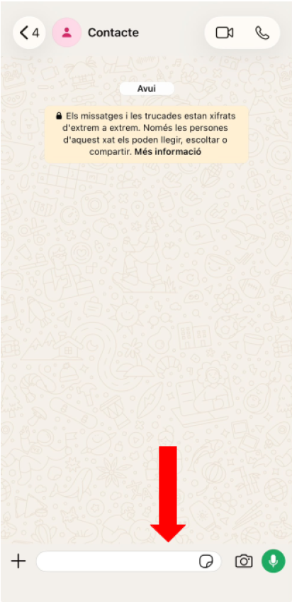
4. Fes clic a l’icone d’enviar.
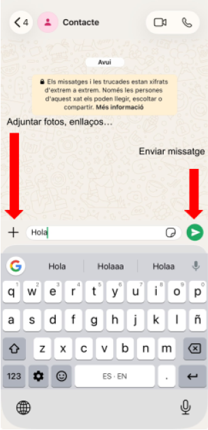

### Enviar una foto
1. Clip o càmera.
2. Fes la foto o tria’n una.
3. Envia.

### Nota de veu
1. Mantén premut el micròfon.
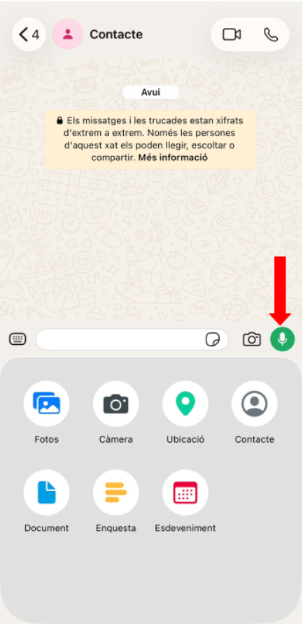
2. Parla.
3. Deixa de pulsar el botó del micròfon.
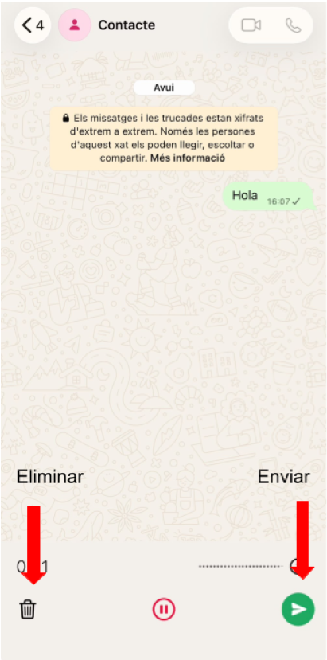

### Videotrucada
1. Entra al xat.
2. Toca la càmera.

✧ ✧ ✧ ✧ ✧ ✧ ✧ ✧ ✧ ✧ ✧ ✧ 
## Fotos i vídeos: fer, trobar, enviar i editar

### Compartir fotos
1. Obre la foto.
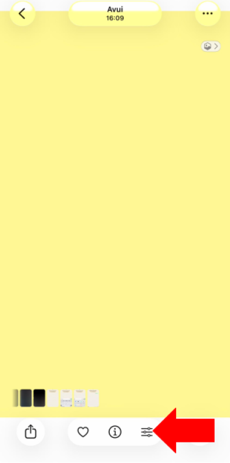

2. Compartir.
3. Tria WhatsApp.
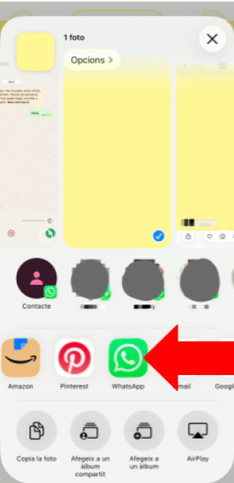

### Editar fotos i vídeos (molt fàcil)
1. Obre Galeria.
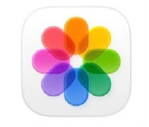
2. Toca el vídeo.
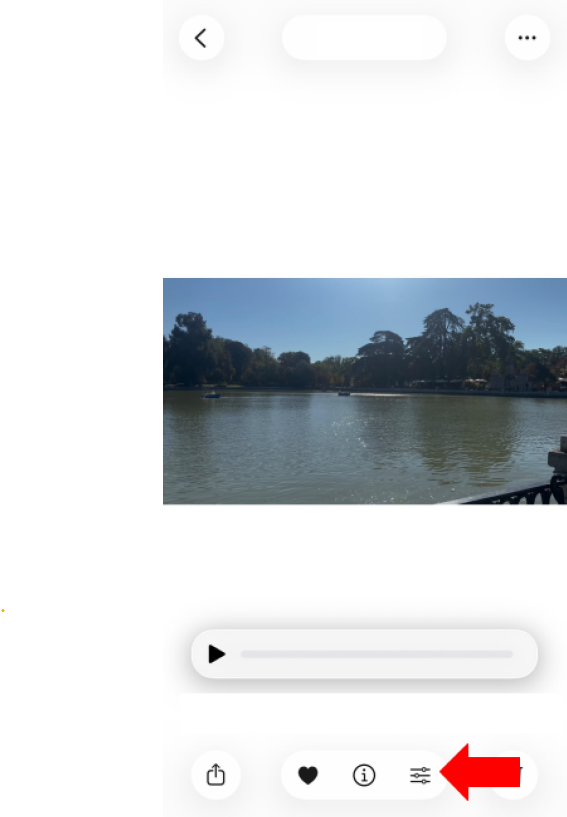
3. Prem Editar.
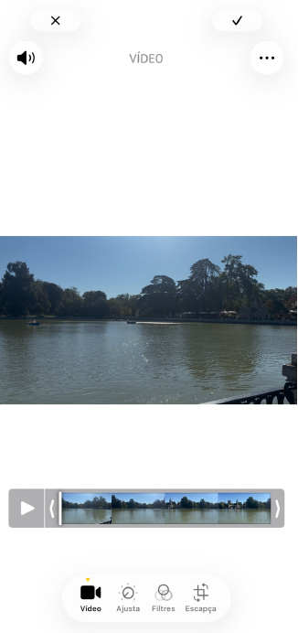
4. Pots tallar, retallar o afegir música.
5. Guarda.

## Manteniment del mòbil

Eliminar fotos duplicades
- **Galeria**

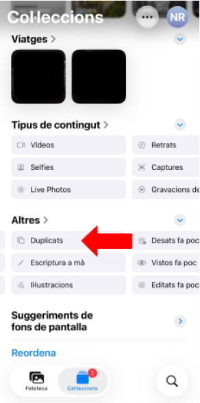
**→ Àlbums → Duplicats**

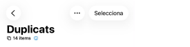
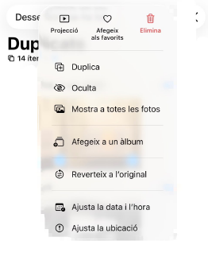

**→ Eliminar**

Eliminar aplicacions que no uses
- Mantén premut sobre l’app → Eliminar
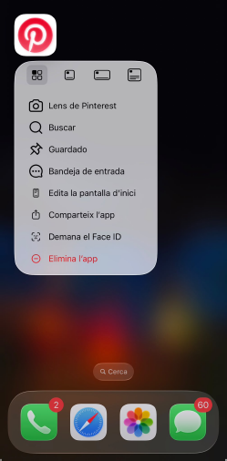

Actualitzar aplicacions Play Store / App Store → Actualitzacions. 

Evitar que el mòbil vagi lent
- Tanca pestanyes, elimina apps, reinicia el mòbil 1 cop per setmana.

✧ ✧ ✧ ✧ ✧ ✧ ✧ ✧ ✧ ✧ ✧ ✧ 
## Internet: buscar, entrar a webs i no perdre’t

### Buscar informació a Google
1. Obre Chrome.
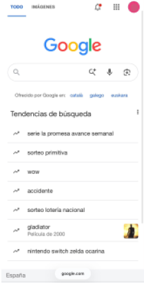

2. Escriu el que vols saber.
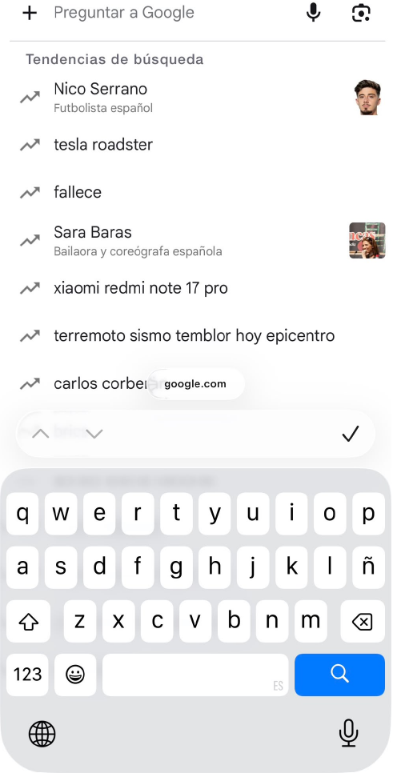

3. Prem Buscar.

### Buscar amb la veu
1. Prem el micròfon.
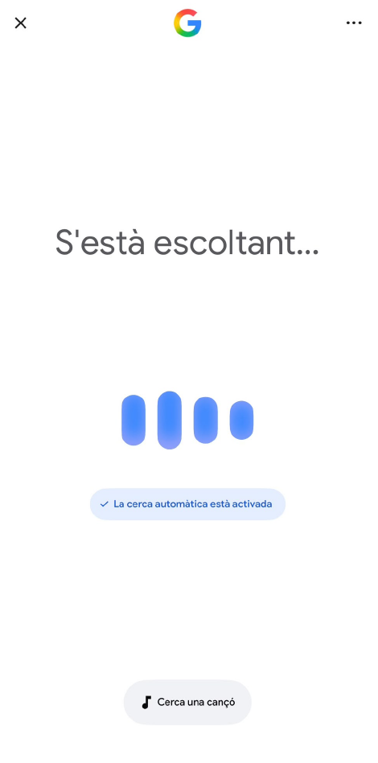

2. Digues el que vols buscar.

### Entrar a una pàgina web
1. Escriu el nom de la web.
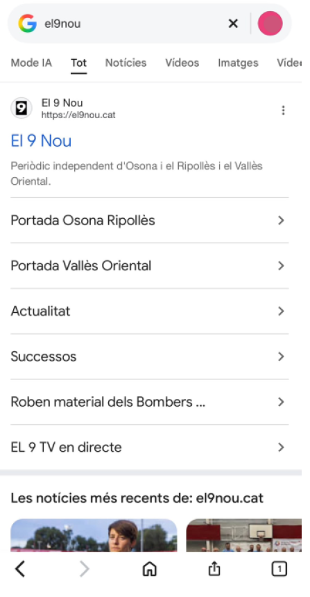

2. Toca el primer resultat oficial.

3. Si et perds, prem “enrere”.

### Tancar finestres
1. Botó de pestanyes.
2. Tanca amb la X.
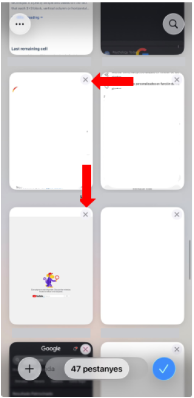

### Xarxes socials explicades fàcilment
- Facebook: Veure fotos de la família, llegir notícies, comentar. 

- Instagram: Story (foto de 24h), Post (foto normal), Reels (vídeos curts). 

- YouTube: Vídeos de música, receptes, notícies, exercicis suaus. 

- TikTok: Vídeos curts. No cal publicar res, només mirar.

### Llenguatge jove explicat
- **LOL**: fa riure 
- **XD**: cara rient 
- **Cringe**: fa vergonya aliena 
- **Mood**: estat d’ànim 
- **Bro**: amic 
- **Spam**: massa missatges 
- **Fake**: fals 
- **Trend**: moda 
- **Viral**: molt popular 
- **Filtro**: efecte per fotos 
- **DM**: missatge privat

- **Story**: foto de 24h
- **Reels**: vídeos curts 
- **Follow**: seguir algú 
- **Unfollow**: deixar de seguir

✧ ✧ ✧ ✧ ✧ ✧ ✧ ✧ ✧ ✧ ✧ ✧ 
## Documents: descarregar, trobar, obrir, enviar i firmar

### Descarregar documents
1. Toca “Descarregar”.
2. El document va a Fitxers → Descàrregues.

### Trobar documents
1. Obre Fitxers.
2. Entra a Descàrregues.
3. Toca el document.

### Obrir PDF
1. Toca el PDF.
2. Fes zoom amb dos dits.
3. Si la lletra és petita, activa el zoom del mòbil.

### Enviar un document
1. Obre el document.
2. Prem Compartir.
3. Tria WhatsApp o correu.

### Firma digital
La firma digital és com una signatura per internet.

1. Normalment:
2. Reps un document.
3. Toca “Firmar”.
4. Escrius la teva signatura amb el dit.
5. Prem “Guardar”.

✧ ✧ ✧ ✧ ✧ ✧ ✧ ✧ ✧ ✧ ✧ ✧ 
## Tràmits online: cita mèdica, documents oficials, webs complicades

### Demana cita mèdica

1. Entra a la web del CAP.
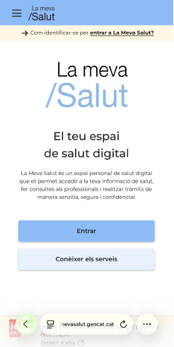

2. Toca “Demana cita”.
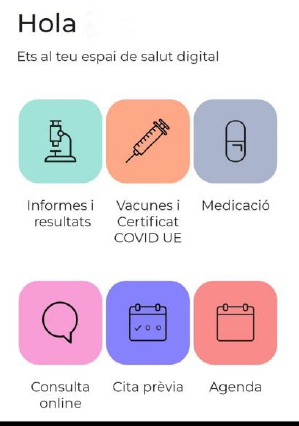
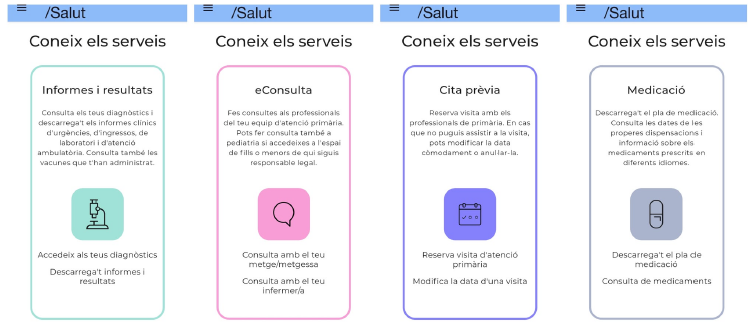

3. Tria metge.
4. Tria dia i hora.
5. Confirmar.

### Fer tràmits oficials
Les webs oficials sovint estan mal dissenyades. No és culpa teva si et perds. 

Consells:
- Llegeix amb calma. 
- Si surt una finestra estranya, tanca-la amb la X. 
- Si no entens alguna cosa, torna enrere. 
- Si demana contrasenya, escriu-la amb tranquil·litat. 
- Si et confons, no passa res: pots començar de nou.

✧ ✧ ✧ ✧ ✧ ✧ ✧ ✧ ✧ ✧ ✧ ✧ 
## Banc digital: moviments, transferències i seguretat

### Entrar al banc
1. Obre l’aplicació.
2. Escriu usuari i contrasenya.

### Consultar moviments
1. Entra a “Moviments”.
2. Llegeix els últims càrrecs.

### Fer una transferència
1. Entra a “Transferències”.
2. Escriu el número de compte.
3. Revisa dues vegades.
4. Confirmar.

### Seguretat
- No comparteixis contrasenyes. 
- No facis transferències si tens dubtes. 
- No cliquis en enllaços sospitosos.

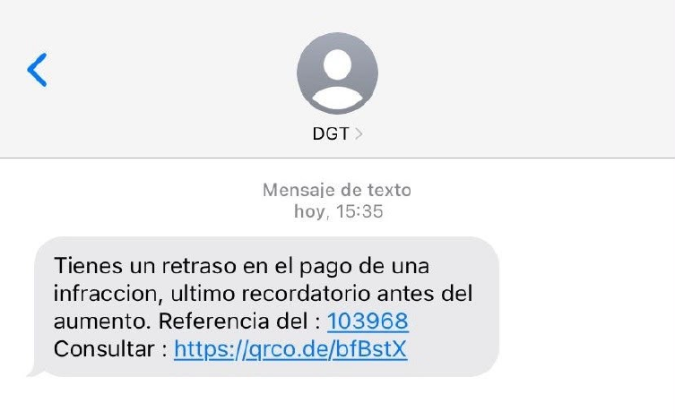
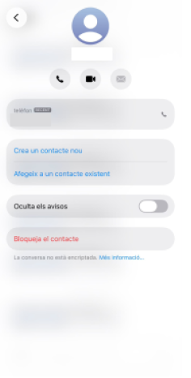

✧ ✧ ✧ ✧ ✧ ✧ ✧ ✧ ✧ ✧ ✧ ✧ 
## Evitar estafes, spam i trucades automàtiques

### Bloquejar números
Telèfon → mantén premut → Bloquejar.

### Detectar estafes
Demanen contrasenyes → sospitós. Premis inesperats → fals. Enllaços estranys → no clicar.

### Trucades automàtiques
Si et demanen “prem 1, prem 2”, pot confondre.

### Consells:
- Escolta amb calma. 
- Si no ho entens, espera: ho repeteixen. 
- Si et perds, penja i torna a trucar.

✧ ✧ ✧ ✧ ✧ ✧ ✧ ✧ ✧ ✧ ✧ ✧ 
## Desconnectar quan el mòbil et satura
- Apaga notificacions. 
- Llegeix llibres digitals amb lletra gran. 
- Mira vídeos relaxants. 
- Fes pauses de 10 minuts.

### Ajuda ràpida
- No trobo una foto: Galeria → Recents. 
- No puc connectar-me al Wifi: Configuració → Wifi. 
- No sé tancar una finestra: Botó de pestanyes → X. 
- No sé fer una videotrucada: WhatsApp → càmera.

## Per a familiars i joves
Si ajudes algú amb el mòbil:

- Parla a poc a poc. 
- Repetir no molesta. 
- Escriu els passos en un paper. 
- No diguis “és fàcil”. 
- No ho facis tu: fes-ho amb ell/a.